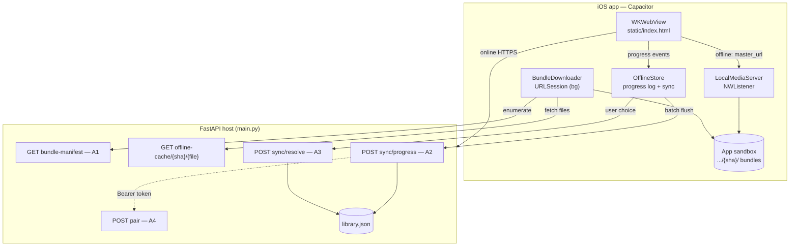
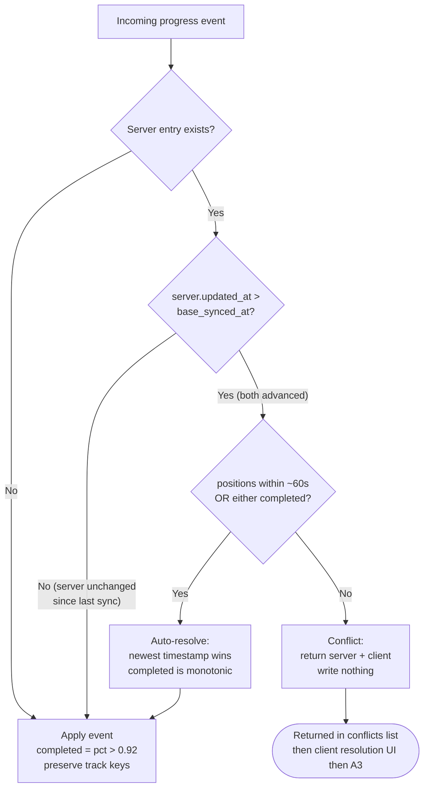
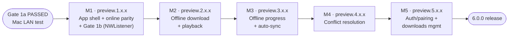
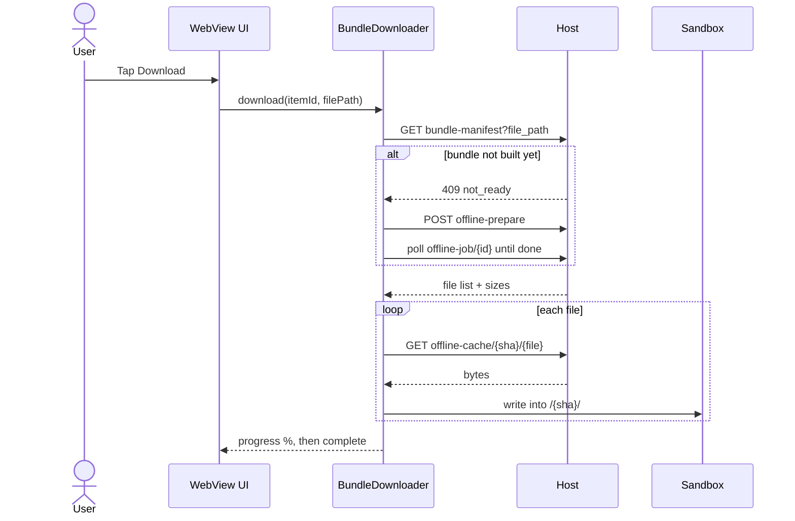
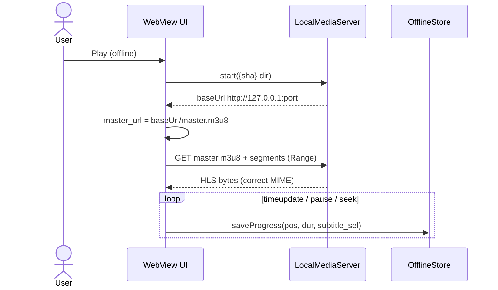

# iOS Client App — Plan for v6.0.0

> **Settings screen + auto-managed downloads (`8.3.0`).** The ☰ App menu gained a
> **Settings** overlay (`_appOpenAppSettings()` in `static/index.html` — an overlay
> ON the live host page, same pattern as Downloads/Change Server, so it never
> disconnects). One feature so far, off by default: **auto-manage downloads while
> watching a series** — keep each watched series' device downloads as a rolling
> window: delete **completed** episodes (via `_appRemoveOne`; never the
> playing/frontier file or its keep-ahead window, other series untouched) and
> ensure the **next N episodes** (default 3, configurable 1–10) are downloaded,
> driving missing ones through `appDownloadBundle` (2-lane `_appRunPooled`,
> fire-and-forget so a long host prep can't wedge later passes; the in-flight
> guard + `queued` marks make overlapping passes idempotent) at a configured
> quality (`original`/1080/720/480 — the bundle-manifest falls back to the best
> available rung, so it never prompts mid-playback). Two feeders share
> `_appAutoFiles`/`_appAutoWants`/`_appAutoApply`: **(a) in-app playback** —
> each episode load (`_lpLoadIndex` → `_appAutoManage`, 4 s delay so the prior
> episode's completion write lands, then `_appAutoManageRun`) rolls the window
> along the live `lp.playlist` (Shuffle order = watch order); **(b) the
> server-progress sweep `_appAutoSweep`/`_appAutoSweepRun`** for episodes watched
> on the **TV (VLC)** or another device while the phone was locked/backgrounded —
> triggered on SSE `open`, app foreground (`visibilitychange`), window `online`,
> and SSE `state` edges where `app.library_current_file` changes or
> `is_library_playback` drops (18 s settle so the VLC tracker's completion write
> lands; 30 s min-interval + pending-timer coalescing). The sweep covers every
> device-downloaded series (player-snapshot sentinel filtered; the lp-active item
> is skipped — the in-app pass owns it), computing the frontier from `/files`
> progress: furthest in-progress episode, else last-completed + 1; never-watched
> series are skipped, fully-watched series get all their downloads cleaned up.
> Prefs persist in host-origin localStorage: `streamlink_app_automanage`,
> `streamlink_app_ahead`, `streamlink_app_autoq`. Online-only
> (`_appOffline`/`navigator.onLine`/`app._connected` gated) and `isApp`-gated;
> host-served, no app rebuild.
>
> **Styled ASS subtitles in the app (`7.15.0`, code).** The 7.14.0 libass-wasm
> (SubtitlesOctopus) styled-subtitle overlay now works on **both** iOS surfaces:
> the online in-app dashboard reuses the host player as-is, and the **offline
> downloads player** (`ios-app/www/downloads.html`) got a parallel implementation
> with the octopus assets vendored into `ios-app/www/` + a `LocalMediaServer.swift`
> MIME update. Inline only (not iOS native fullscreen). Requires a `./build-ipa.sh`
> rebuild; on-device verification pending. See [STREAMING.md](STREAMING.md) /
> [GOTCHAS.md](GOTCHAS.md).
>
> **Durable downloads + bulk management (`7.8.0`, code).** Post-6.0.0 hardening of
> the offline-download pipeline against **long** outages and an app kill, plus
> Downloads-screen bulk actions. The download *intent* is now persisted natively the
> instant Download is tapped — a durable **`queue.json`** in `BundleDownloader`
> (`enqueue`/`dequeue`/`queueList`), separate from `index.json` (which tracks bundles
> already handed to the `URLSession`). The dashboard re-drives every still-wanted
> entry via **`_appResumeDownloadQueue()`** on launch and on every `online` event, so
> a season queued before a multi-hour tunnel/Airplane stretch finishes whenever the
> link returns — even across a relaunch. Native transient retries (`retryOrFail`) lost
> their cap: a handed-off file retries indefinitely while the background session waits
> for connectivity, so only a *permanent* error (`bundleError`) is terminal. The in-app
> **Downloads overlay** (`_appRenderDashboard`) gained a Select mode (per-episode
> checkboxes, series-level **All**, **Select all**, **Remove (N)**), a per-series
> **Remove all**, a per-row **✕** to stop an in-flight download, and a **Resume all**
> shortcut when something is stalled waiting on the network. No new Swift files / no
> pbxproj or `capacitorDidLoad` change — only methods added to the existing
> `BundleDownloader` plugin. **On-device verification pending** (queue a season →
> Airplane Mode for hours → relaunch → all complete on reconnect; bulk remove /
> series-remove). See [GOTCHAS.md](GOTCHAS.md) (durable-queue footguns).
>
> **Downloads picker redesign (`8.2.0`).** The overlay's "Downloaded on this
> device" list is now a stripped-down mirror of the web episode picker: titles
> sorted A→Z, each series' episodes bucketed under **season divider rows**
> (positive seasons ascending, season-0 files trailing as "Specials" — the same
> rule as the web season tabs; movies/no-season items stay a flat list), episodes
> sorted by episode number within each season (`E05` chip — season implicit under
> a divider), and the web picker's **✓ Watched / in-progress %** badges + 3 px
> progress bar per row, read from `OfflineStore.all()` filtered to the active
> profile (server-seeded on every reconnect, so one source serves online and
> offline). Select mode / Remove all / Play semantics unchanged. Host-served
> asset only — no app rebuild.
>
> **Status:** **M5 landed (code)** (`6.0.0-preview.5.0.0`) — device pairing/auth +
> in-app navigation + downloads management. **A4** is implemented: **`POST /api/pair`**
> ([main.py](../main.py)) issues a long-lived bearer token (admin password = pairing
> secret), persisted to host-local `device_tokens.json` so paired devices survive a
> restart; **`GET /api/pair/status`** and **`DELETE /api/pair`** (self-revoke) round it
> out, with admin **`/api/admin/devices`** list/revoke. `_require_device_auth` gates
> the device-facing endpoints (`/api/sync/progress|pull|resolve`,
> `/api/library/{id}/bundle-manifest`) on a valid device-or-admin token **only when
> the new `REQUIRE_DEVICE_AUTH` setting is on** — it defaults **off**, so LAN/browser
> use and online HLS playback are completely unaffected (no-regression). The native
> `OfflineStore` stores the token (`set/getPairingToken`) because the connect shell
> (`capacitor://`) and host dashboard (`https://`) can't share `localStorage`; the
> shell's Connect screen pairs with the host password; the dashboard reads the token
> back and sends `Authorization: Bearer` on every device-facing fetch, and shows an
> always-on `☰ App` menu (Dashboard / Downloads / Change Server / Re-pair). Downloads
> management (`list`/`remove`/`bytesUsed`) already shipped in `BundleDownloader` +
> `downloads.html`. The **Dashboard** entry (`6.0.0-preview.5.3.0`) opens a host-page
> overlay — live server-connection status (from SSE `app._connected`), ongoing
> downloads with live % (from the `offlineBundles` map), and storage grouped by
> series/movie (`_cap.dl.list()`) — refreshing on a 1 s tick while open. It lives on
> the host page so the SSE link stays connected, unlike the offline `downloads.html`.
> **Known gap (intentional):** the *shared* online-playback surfaces
> (`/api/library/offline-cache/*`, `/offline-prepare`, `/api/library`) are **left
> open** even under `REQUIRE_DEVICE_AUTH` — gating them would break the browser
> dashboard and online HLS playback (those fetches, incl. hls.js segment GETs, carry
> no token). Full dashboard auth for hostile-network exposure is a larger change
> (the dashboard itself would need to authenticate) and is deferred past 6.0.0.
> Remaining on M5 is **on-device verification**: pair over a real remote link, confirm
> unpaired callers are rejected, and the in-app nav reaches settings/downloads.
>
> **M4 landed (code)** (`6.0.0-preview.4.0.0`) — sync-conflict
> resolution. The host **A3** endpoint **`POST /api/sync/resolve`**
> ([main.py](../main.py)) writes the user-chosen winner for a divergence A2
> reported: `choice:"client"` writes the device values (reusing the A2 merge shape,
> `completed` monotonic, track keys preserved, bumps `updated_at`); `choice:"server"`
> writes nothing; either way it returns the authoritative `server` values +
> `server_updated_at`. The dashboard's `_appFlushOfflineProgress`
> ([static/index.html](../static/index.html)) collects A2's `conflicts` and opens the
> `#syncConflictModal` "keep mine / keep server" UI; on Apply it POSTs `/sync/resolve`
> and settles the `OfflineStore` record (a "mine" win advances the watermark via
> `markSynced`; a "server" win adopts the server values via a **forced**
> `seedProgress`, new `force` flag overriding the unsynced-record guard). Remaining
> on M4 is **on-device verification**: deliberately diverge a file (offline + TV),
> confirm the conflict UI appears and the chosen winner is written and re-synced.
>
> **M3 landed (code)** (`6.0.0-preview.3.0.0`) — offline progress +
> auto-sync. The host **A2** endpoint **`POST /api/sync/progress`**
> ([main.py](../main.py)) does batch sync with real conflict detection via a
> per-file `base_synced_at` watermark (apply / auto-resolve / conflict), verified
> against the full conflict matrix. The native **`OfflineStore`**
> ([`OfflineStore.swift`](../ios-app/ios/App/App/OfflineStore.swift)) is a durable,
> file-backed progress log; the offline [`www/downloads.html`](../ios-app/www/downloads.html)
> player captures progress + resumes offline; the dashboard pushes the active
> profile (`setProfile`) and drains the store (`_appFlushOfflineProgress`) on
> profile-select and the `online` event. **Conflict resolution is M4 (above).**
>
> **M3.1** (`6.0.0-preview.3.1.0`) closed three gaps: sync is now **bidirectional**
> (**`POST /api/sync/pull`** + `OfflineStore.seedProgress` seed the server's
> progress as the offline baseline, at download time and on every reconnect, so
> offline resume reflects online history); the flush was hardened so it always
> reaches the seed step and only refreshes the library when the server advanced; and
> the bundle now carries **series/episode metadata + an inlined poster** (`meta` on
> the bundle-manifest, persisted by `BundleDownloader`) so the offline
> [`downloads.html`](../ios-app/www/downloads.html) picker **groups by series** with
> poster, episode names, overview and per-episode watch-progress bars. Remaining on
> M3 is **on-device verification**: watch offline, reconnect, confirm history lands
> on the server and an auto-resolvable case merges silently.
>
> **M2 landed** (`6.0.0-preview.2.1.0`) — offline download + fully-offline playback.
> Host **A1** `bundle-manifest`; native **`BundleDownloader`** (foreground URLSession
> — a background session deferred all progress to next launch, see
> [GOTCHAS.md](GOTCHAS.md)); offline entry point [`www/downloads.html`](../ios-app/www/downloads.html)
> (the remote dashboard can't load offline). The dashboard's `_lpLoadIndex`
> `master_url` swap remains the *online* convenience.
>
> **M1 landed** (`6.0.0-preview.1.0.0`) — Capacitor shell, first-run Connect
> screen, native `LocalMediaServer` (Gate 1b). Its remaining gate is the same
> on-device pass (online parity + the "Localhost HLS self-test").
> Later milestones (M4–M5) remain as planned below.
> This is the implementation plan for the **6.0.0** major release (a new
> top-level capability: a native client app). Pieces ship incrementally; the
> version badge in `static/index.html` + `CHANGELOG.md` get bumped as each lands,
> culminating in **6.0.0** when offline download → playback → sync works
> end-to-end on iOS. See [Versioning](#versioning) for the pre-release scheme.

---

## Versioning

The working release is **6.0.0**. While building toward it, every change uses a
**SemVer pre-release** tag:

```
6.0.0-preview.<x>.<y>.<z>
```

- `<x>.<y>.<z>` keep their normal [CLAUDE.md](../CLAUDE.md) meanings **within the
  preview line** — `x` = major feature, `y` = minor feature, `z` = bug fix — so the
  per-change bump rules don't change; they just live under the `6.0.0-preview.`
  prefix.
- **Use a dot before the triple, not a hyphen.** `6.0.0-preview.1.2.3` is correct;
  `6.0.0-preview-1.2.3` is not. SemVer compares dot-separated pre-release
  identifiers, comparing **numeric** ones numerically — so with dots,
  `6.0.0-preview.1.2.3 < 6.0.0-preview.1.3.0`, and **any** `6.0.0-preview.*` sorts
  before the final `6.0.0` (a pre-release always ranks below the release). The
  hyphen form folds `preview-1` into a single text identifier and breaks numeric
  ordering.
- **Example progression:** `6.0.0-preview.1.0.0` (first preview feature) →
  `6.0.0-preview.1.0.1` (fix) → `6.0.0-preview.1.1.0` (minor feature) → … →
  **`6.0.0`** (drop the suffix at release).
- The version badge in `static/index.html` + a `CHANGELOG.md` bullet are updated in
  the same patch as every change, exactly as today — just carrying the
  `6.0.0-preview.x.y.z` value until release.

> **Simpler alternative (not chosen):** `6.0.0-preview.N`, a single incrementing
> counter. Standard and minimal, but it drops the feature-vs-fix granularity the
> triple encodes — so this project keeps the triple.

---

## Context

StreamLink today is a local web dashboard (FastAPI host + browser UI). The
on-device player in `static/index.html` is already a full HLS player (hls.js +
Safari-native) with progress sync, multi-audio/sub, ABR, reconnect, and
skip-intro — so the **online** experience is already mobile-web-capable
(see [STREAMING.md](STREAMING.md)).

The reason for a client app is **reliable extended-offline** use: download a
season to the phone, play it in-app with no host connection, track watch history
offline, and sync that history back to the server on reconnect — with user
resolution for conflicts that can't be auto-resolved.

A pure web wrapper / PWA **cannot** do this on iOS: web storage is an evictable
cache (Safari/WKWebView purges it under pressure or after ~7 days), there is no
reliable background download, and WKWebView Service Workers are gated/flaky. The
offline core must be native; everything else (search, library, the player UI,
online streaming) is reused as-is.

**Scope: iOS only.** Android is deferred — the chosen design (Capacitor + a
localhost static server) ports cleanly later (NanoHTTPD + `DownloadManager` /
`WorkManager` replace the iOS equivalents; the web UI and all new server
endpoints are shared).

**Platform-priority note:** the iOS app is the only Apple-surface deliverable and
is exempt from the repo's Windows-first rule. **The new *server* endpoints
(bundle-manifest, sync, pairing) run on the host and MUST be correct on the
Windows deployment target** per [CLAUDE.md](../CLAUDE.md).

---

## Decisions (locked)

| Decision | Choice | Why |
|----------|--------|-----|
| App framework | **Capacitor** (WKWebView shell + Swift plugins) | Max reuse of the existing player/library UI. Not React Native / full native (those rewrite the UI). |
| Offline playback | **Reuse the existing web player** via a localhost HLS server | The `.offline_cache/<sha>/` dir is already a self-contained HLS bundle; serve it at `http://127.0.0.1:<port>/` and swap the player's `master_url`. Multi-audio/sub/ABR/skip-intro work unchanged. |
| iOS player engine | **Native HLS** (`<video>.src`), not hls.js | iOS path in [STREAMING.md](STREAMING.md) "Play on this device" step 4. ⇒ the local server must return correct HLS MIME + support `Range`. |
| Embedded server | **Roll-your-own `Network.framework` `NWListener`** | GCDWebServer is archived; a static-file HLS server (GET + MIME + `Range`) is ~150 lines with zero dependency lifetime risk. Fallbacks: FlyingFox / Hummingbird. Avoid Telegraph (stale) / Vapor (overkill). |
| Distribution | **Personal / TestFlight** | Light device-pairing token auth; no App Store review constraints. |

---

## Architecture

```
┌─ iOS app (Capacitor project) ───────────────────────────────────┐
│  WKWebView ── loads static/index.html                            │
│     • ONLINE: points at the host server over HTTPS (as today)    │
│     • OFFLINE: same UI; player master_url swapped to localhost   │
│                                                                  │
│  Swift Capacitor plugins (the only new native code):             │
│   1. BundleDownloader  — URLSession background download of a     │
│                          full .offline_cache/<sha>/ bundle to    │
│                          the app sandbox; resumable; progress    │
│   2. LocalMediaServer  — NWListener static server over the       │
│                          downloaded dir (MIME + Range)           │
│   3. OfflineStore      — on-device progress log + sync/conflict  │
└──────────────────────────────────────────────────────────────────┘
                       │ HTTPS (online only)
                       ▼
        FastAPI host (main.py) — existing + new endpoints
```

**Why the bundle reuse works:** an `.offline_cache/<sha>/` dir is already a
self-contained HLS bundle (`master.m3u8`, variant playlists, `init_*.mp4`,
`seg_*.m4s`, sidecar `sub_*.vtt`, `meta.json`) — see [STREAMING.md](STREAMING.md)
"Output format" and the server at `offline_cache_bundle_file`
([main.py:15638](../main.py#L15638)). Downloading that dir verbatim and serving it
from localhost means the existing player needs only its `master_url` swapped from
`/api/library/offline-cache/<sha>/master.m3u8` to
`http://127.0.0.1:<port>/master.m3u8`.

### Component chart



---

## Work breakdown

### A. Server changes (`main.py`, docs) — Windows-correct

The only backend changes, and the bulk of the *novel logic*.

**A1. Bundle manifest endpoint** (small).
`GET /api/library/{item_id}/bundle-manifest?file_path=…` → flat list of bundle
files (relative names + byte sizes + total) plus `duration_sec`, `audios`,
`subtitles` (from `meta.json`) and the sidecar `subs` list, so the iOS downloader
enqueues deterministically with real progress instead of crawling playlists.
- Reuse: `_offline_cache_key(src)`, `_read_meta(out_dir)`, `_list_sidecar_subs`
  — already used by `offline_prepare` ([main.py:15145-15164](../main.py#L15145-L15164)).
- Reuse the existing per-file server ([main.py:15638](../main.py#L15638)) for the
  actual file downloads (already traversal-guarded by `_CACHE_KEY_RE` /
  `_BUNDLE_FILE_RE`); the manifest only enumerates.
- If the bundle isn't built yet → 409 `not_ready`; the app triggers a normal
  `POST /offline-prepare` and polls `/offline-job/{id}` first. (Only fully-prepped
  bundles are downloadable — JIT on-demand stays online-only.)
- Document in [API.md](API.md); reference from [STREAMING.md](STREAMING.md).

**A2. Batch progress sync + conflict resolution** (the real new work).
Today progress is written one file at a time, last-write-wins, **no conflict
detection** — `update_progress` ([main.py:6692-6716](../main.py#L6692-L6716)),
schema in [LIBRARY_DATA.md](LIBRARY_DATA.md) "Progress (per profile)".

Add `POST /api/sync/progress`:
```jsonc
{
  "profile_id": "...",
  "events": [
    { "item_id": "...", "file_path": "...",
      "position_sec": 1234.5, "duration_sec": 4174.0,
      "client_updated_at": "2026-06-18T20:01:00Z",  // when watched on device
      "base_synced_at":    "2026-06-17T09:00:00Z",  // device's last sync of THIS file
      "subtitle_sel": {...}, "local_audio_idx": 0 } // optional, preserved
  ]
}
```
Per-event logic:
- **No server entry, or server `updated_at` ≤ `base_synced_at`** → server unchanged
  since the device last synced → **apply** the device event. Reuse the exact merge
  shape of `update_progress`: recompute `completed = pct > 0.92`, preserve sibling
  track keys (`audio_track`/`subtitle_track`/`local_audio_idx`/
  `local_subtitle_idx`/`subtitle_sel`).
- **Server `updated_at` > `base_synced_at`** (both advanced): if positions agree
  within a threshold (≈60 s) OR one side is `completed`, auto-resolve (newest
  timestamp wins; `completed` is monotonic — never un-complete). Otherwise emit a
  **conflict**: return `{server, client}` for that file and write nothing.
- Response: `{ applied:[...], conflicts:[...], server_updated_at }`. The app records
  `server_updated_at` as each applied file's new `base_synced_at`.
- All writes under `_lib_lock` (`get_library`/`put_library` or `_load_lib_raw`/
  `_save_lib_raw`) — process the whole batch under one lock acquisition; never raw
  (see [LIBRARY_DATA.md](LIBRARY_DATA.md) "Concurrency").
- Document the endpoint + the `base_synced_at` watermark in [API.md](API.md) and
  [LIBRARY_DATA.md](LIBRARY_DATA.md).

Per-event decision logic (A2):



**A3. Conflict-resolve apply** (small).
`POST /api/sync/resolve` (or a `force` flag on A2) writes the user-chosen
winner for a previously-reported conflict, bumping `updated_at`.

**A4. Device-pairing token** (light, needed for remote use).
Regular library/progress endpoints take an unauthenticated `profile_id` in the
body (only an *admin* token exists today — [main.py:939](../main.py#L939)).
- `POST /api/pair {admin_password}` → long-lived device token (persisted list,
  same pattern as `_admin_sessions`).
- Accept `Authorization: Bearer <device_token>` on sync + manifest (ideally also
  `/offline-prepare`, `/files`, `/api/library`). Reuse `admin_password` as the
  pairing secret. Can be deferred if first cut is LAN-only, but scope now.

### B. Capacitor iOS project (new; lives in `ios/` or a sibling project)

**B1. Skeleton.** `npx cap init`, add iOS platform, WKWebView loads the host URL
(first-run server-address + token entry). ATS exception for `http://127.0.0.1:*`
only (the localhost player).

**B2. `LocalMediaServer` plugin (Swift).** `NWListener` static-file server.
- `start(bundleDir) -> {baseUrl}` mounts a `<sha>/` dir at `127.0.0.1:<port>`;
  `stop()`.
- Correct MIME (`application/vnd.apple.mpegurl` m3u8, `video/mp4` m4s/init,
  `text/vtt`) — mirror `_HLS_MIME` — and honor `Range`.
- The validated spike's ~90-line Python handler is the reference port.

**B3. `BundleDownloader` plugin (Swift).** `URLSession` background config.
- `download(itemId, filePath)` → call `bundle-manifest`, enqueue every file to a
  non-evictable app-support dir keyed by `<sha>/`, report progress, resumable.
- `list()`, `delete(sha)`, `bytesUsed()` for a Downloads screen.
- Mark dir `isExcludedFromBackup`; store in Application Support (not Caches).

**B4. `OfflineStore` plugin + JS glue.** Local progress log keyed by
`(profile_id, item_id, file_path)` with `position/duration/client_updated_at/
base_synced_at`. A connectivity watcher flushes to `POST /sync/progress` when
online, surfaces conflicts to a resolution UI, calls A3 on resolve.

**B5. Web-UI glue (minimal `static/index.html` edits, behind a Capacitor flag).**
Detect `window.Capacitor`; when present:
- A **Download** affordance per item/episode → `BundleDownloader`.
- In `_lpLoadIndex`, when a bundle is downloaded locally, set `lp.mode="bundle"`
  and point `master_url` at the `LocalMediaServer` base URL instead of POSTing
  `/offline-prepare`. Everything downstream (tracks/subs/skip/progress) unchanged.
- Route `saveProgress`/`_lpFlushProgress` to `OfflineStore` when offline (already
  throttles + flushes on `pause`/`seeked`/`pagehide` — see [STREAMING.md](STREAMING.md)
  "Watch progress"); online path untouched.
- Add a Downloads + conflict-resolution screen.
- Guard every edit so the plain browser UI is byte-for-byte unaffected.

---

## Delivery roadmap — what to build, in what order

Each milestone is an **independently shippable, on-device-testable** increment and
maps to a preview-version line. Build strictly in order: each depends on the one
before. The guiding principle is **value-first, risk-first** — get a usable app on
the phone (M1), then the one thing only a native app can do (offline playback, M2),
then make that history trustworthy (sync M3 → conflicts M4), then make it safe to
use remotely (auth M5).



| Milestone (version line) | What it adds (user-visible) | Server work | App work | Done when |
|---|---|---|---|---|
| **M1** `6.0.0-preview.1.x.x` — App shell + online parity | The app exists: install on iPhone, it *is* the dashboard. Full online experience identical to the browser. | — | B1 Capacitor skeleton + first-run server/token screen. **Gate 1b**: port the spike server to `NWListener`, prove localhost HLS + ATS on-device. | App runs on a real device; online search/library/play/admin all behave exactly as in the browser; a downloaded sample bundle plays from the on-device `NWListener` server. |
| **M2** `6.0.0-preview.2.x.x` — Offline download + playback | **The core feature.** Download an episode/season; play it fully offline (Airplane Mode) with audio, subtitles, ABR, skip-intro. | **A1** bundle-manifest endpoint. | **B3** `BundleDownloader` (bg, resumable) → **B2** `LocalMediaServer` → **B5** Download button + `master_url` swap in `_lpLoadIndex`. | Download a multi-episode item online → Airplane Mode → play 2 episodes with working tracks/subs/skip; files survive app kill + relaunch. |
| **M3** `6.0.0-preview.3.x.x` — Offline progress + auto-sync | Offline watch history is kept and **flows back to the server** on reconnect (auto-resolvable cases only). Resume works offline. | **A2** `sync/progress` (apply + auto-resolve path). | **B4** `OfflineStore` (local progress log, offline resume) + connectivity-watcher flush; route `saveProgress`/`_lpFlushProgress` to it when offline. | Watch offline, reconnect → history appears on the server; device-only and close-position cases merge silently; `completed` never regresses. |
| **M4** `6.0.0-preview.4.x.x` — Conflict resolution | When the same episode advanced both offline **and** elsewhere (e.g. the TV), the app asks the user which to keep. | **A3** `sync/resolve` + surface conflicts from A2. | Conflict-resolution UI (mine vs server) wired to the sync flush. | A deliberately-divergent case (offline + TV) surfaces a conflict and the chosen winner is written and re-synced. |
| **M5** `6.0.0-preview.5.x.x` — Auth/pairing + downloads mgmt + hardening ✅ *(code)* | Safe remote use over the internet; manage/delete downloads and see storage used; always-on in-app nav to settings/downloads. | **A4** `POST /api/pair` (+ `/pair/status`, `DELETE /pair`, admin `/admin/devices`) + `REQUIRE_DEVICE_AUTH`-gated Bearer enforcement on `sync/*` + `bundle-manifest`. Shared online-playback surfaces left open (see status note). | Connect-screen pairing (host password); native token store (`OfflineStore.set/getPairingToken`); dashboard Bearer headers + `☰ App` nav; downloads mgmt (`list`/`remove`/`bytesUsed`) in `downloads.html`. | Unpaired callers rejected when enforcement is on; downloads are listable/removable; settings + downloads reachable in-app online/offline. |
| **🚀 Release** `6.0.0` | All of the above, integrated and verified. | — | — | Full [Verification](#verification) end-to-end cycle green; docs updated; suffix dropped to `6.0.0`. |

> **De-risk gates (not features):** **1a** (Mac LAN static-server) is ✅ **PASSED
> (2026-06-18)** — a generated fmp4 HLS bundle (ffmpeg `testsrc2`+`sine`; master +
> video + audio + `sub_0.vtt`) served from a small Python static server (HLS MIME +
> `Range`) played on a real iPhone via both native `master.m3u8` and a
> `<video>`+`<track>` page (audio, subtitle toggle, scrub all worked). **1b**
> (on-device `NWListener` localhost + ATS) is folded into **M1** as the gating task —
> the native server ([`LocalMediaServer.swift`](../ios-app/ios/App/App/LocalMediaServer.swift))
> + a bundled sample + a one-tap self-test ([`localtest.html`](../ios-app/www/localtest.html))
> are **written and type-checked**; the on-device pass is the remaining M1 step.

### Core flows

**Offline download (M2):**



**Offline playback + progress capture (M2 → M3):**



**Sync + conflict resolution (M3 → M4):**

```mermaid
sequenceDiagram
  participant OS as OfflineStore
  participant H as Host
  actor U as User
  Note over OS: device back online
  OS->>H: POST sync/progress { events[] + base_synced_at }
  H->>H: per-event decision (A2 chart above)
  H-->>OS: { applied[], conflicts[], server_updated_at }
  OS->>OS: base_synced_at = server_updated_at (applied)
  alt conflicts present
    OS->>U: resolution UI (mine vs server)
    U->>OS: choose winner
    OS->>H: POST sync/resolve { choice }
    H-->>OS: ok (updated_at bumped)
  end
```



---

## Verification

- **Server endpoints:** unit-test the A2 conflict matrix against the merge logic —
  (a) device-only advance applies; (b) server-newer + close positions auto-resolves;
  (c) server-newer + divergent positions returns a conflict and writes nothing;
  (d) `completed` never regresses; (e) track prefs (`subtitle_sel` etc.) survive a
  sync write. Run on the **Windows** host path (lock usage, no POSIX assumptions).
- **End-to-end offline cycle:** download a multi-episode item online → Airplane
  Mode → play 2 episodes part-way → kill + relaunch (history intact, files durable)
  → re-enable network → confirm sync flushes, an auto-resolvable case merges
  silently, and a deliberately-divergent case (also advanced on the TV) surfaces
  the conflict UI and resolves correctly.
- **No-regression:** load `static/index.html` in a desktop browser; player/library/
  admin behave exactly as before (all native glue is bridge-gated).

---

## Milestone: Live Activities (`6.0.0-preview.6.0.0`)
Background downloads + lock-screen/Dynamic Island UI, and a Dynamic Island TV remote.

- **New target** `StreamLinkLiveActivities` (widget extension, `app-extension`,
  bundle `com.streamlink.client.LiveActivities`, deployment **iOS 17**), embedded
  in the App via an "Embed Foundation Extensions" copy phase. Shares the **App
  Group** `group.com.streamlink.client` with the App; App `Info.plist` sets
  `NSSupportsLiveActivities`. Both targets/entitlements added by hand in
  `project.pbxproj` (`cap sync` never touches targets — see GOTCHAS).
- **Shared sources** (membership in App + extension): `Shared/LiveActivityAttributes.swift`
  (`DownloadActivityAttributes`, `TVRemoteAttributes`), `Shared/AppGroupConfig.swift`
  (host URL / token / VLC-vs-YouTube in the App Group), `Shared/TVRemoteIntents.swift`
  (`LiveActivityIntent`s that POST control commands — run in the app process).
- **Downloads (Feature 1):** `BundleDownloader` now uses a **background URLSession**
  + `AppDelegate.handleEventsForBackgroundURLSession` → genuine background
  completion. `DownloadLiveActivity` shows aggregate progress; widget UI in
  `StreamLinkLiveActivities/DownloadActivityWidget.swift`.
- **TV remote (Feature 2):** `TVRemote` Capacitor plugin (registered in
  `MainViewController.capacitorDidLoad()`) starts/updates/stops the activity; the
  dashboard's `_tvRemoteSync()` (isApp-gated, in `static/index.html`) drives it
  when the fullscreen controls are open over an active TV session. Widget UI +
  buttons in `StreamLinkLiveActivities/TVRemoteWidget.swift`.
- **Build/sign:** `.appex` builds with the App scheme (target dependency); one-time
  Xcode pass to confirm automatic signing provisions the App Group for both targets.

---

## Out of scope (this release)
- Android (deferred — design is portable).
- Offline of JIT on-demand / `ondemand_only` items (online-only by nature).
- App Store submission hardening.

---

## Docs to update as pieces land
- [API.md](API.md) — `bundle-manifest`, `sync/progress`, `sync/resolve`, `pair`.
- [LIBRARY_DATA.md](LIBRARY_DATA.md) — `base_synced_at` watermark + conflict semantics on progress.
- [STREAMING.md](STREAMING.md) — offline-bundle download + localhost-server playback path.
- [GOTCHAS.md](GOTCHAS.md) — any iOS ATS / native-HLS / localhost footguns found.
- [CLAUDE.md](../CLAUDE.md) docs index — add this subsystem row once code exists.
- `static/index.html` version badge + `CHANGELOG.md` — bump per piece as
  `6.0.0-preview.x.y.z` (see [Versioning](#versioning)), dropping the suffix at the **6.0.0** release.
